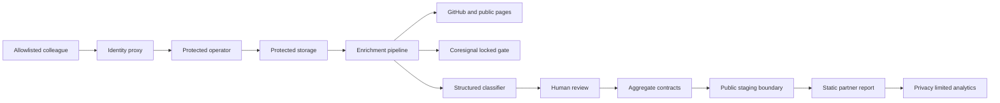

# START Community OS talent pipeline threat model

## Executive summary

The highest risks are unauthorized access to the protected operator, enrichment calls that bypass notice or source authorization, SSRF or credential leakage through applicant URLs, and accidental deployment of mixed private/public output. The implementation now separates the public staging boundary, pins public-page DNS to the validated socket, hard-gates Coresignal, and requires proxy authentication plus a colleague allowlist. Encrypted production storage, a real identity proxy, provider/legal approval, backup/restore testing, and incident operations remain deployment decisions.

## Scope and assumptions

- In scope: `community_os/enrichment/`, `community_os/privacy_operations.py`, `community_os/release_operator.py`, `community_os/publication.py`, `community_os/postpublication_analytics.py`, real report rendering, and `deploy/`.
- Public surface: aggregate-only static HTML/PDF and public aggregate/manifest staged from an explicit allowlist.
- Private surface: server-side operator behind TLS and an authenticated identity proxy, restricted to allowlisted colleagues.
- Raw exports, enrichment payloads, private overrides, review queues, audit records, and tokens never enter the public deployment.
- The operator is single-event and single-organization. Multi-tenancy is out of scope.
- Open questions requiring the release owner and qualified review: approved hosting region/provider, identity proxy, encrypted storage and key owner, backup retention, GitHub/source terms, Coresignal contract and source authorization, and AI processor approval.

## System model

### Primary components

- Browser operator: four protected uploads, review queues, stage controls, preview, and exports. Evidence: `community_os/release_operator.py`.
- Protected pipeline: cached GitHub/public-page/Coresignal adapters, structured classifier, stage state, and privacy operations. Evidence: `community_os/enrichment/`, `community_os/privacy_operations.py`.
- Aggregate/report builder: strict contracts, suppression, rich partner renderer, PDF exporter. Evidence: `community_os/real_report.py`, `community_os/partner_report.py`, `community_os/pdf_export.py`.
- Public staging: explicit artifact allowlist and privacy scan. Evidence: `community_os/publication.py`.

### Data flows and trust boundaries

- Colleague browser -> identity proxy -> operator: personal data and actions over TLS; proxy identity, shared proxy secret, allowlist, CSRF header, size limits, and no-store/security headers.
- Operator -> protected storage: raw exports, override/review state, caches, and audit; server-side filesystem boundary with restrictive file modes. Production encryption and managed keys are required.
- Pipeline -> GitHub/public pages/Coresignal: applicant-supplied identifiers only; structured allowlists, bounded HTTP, pinned public IP, prevalidated redirects, retry limits, provider gates, and expiry.
- Pipeline -> optional AI processor: pseudonymous code-only structured inputs; documented approval, DPA/terms, retention mode, region/security profile, and field allowlist required before a provider call.
- Protected aggregate -> public staging: only validated aggregate HTML/PDF/JSON and sanitized manifest; private files fail the allowlist.
- Public staging -> deployment staging: off by default; a separate hash-bound release-owner action adds an exact Vercel response-header configuration and a fixed aggregate-only event/property allowlist.
- Hosted public report -> PostHog: EU endpoint only, per-load random identifier, person-profile processing disabled, no browser storage, and project-level IP capture machine-verified through a short-lived read-only project-settings receipt. Hosted traffic and final response behavior still require deployment-time verification.

#### Diagram

## Assets and security objectives

| Asset | Why it matters | Objective |
|---|---|---|
| Names, emails, profile identifiers, public-page data | Direct and linkable personal data | Confidentiality, integrity |
| Inferred classifications and review decisions | Can affect consequential partner impressions | Confidentiality, integrity |
| Provider and proxy secrets | Enable data access and paid calls | Confidentiality |
| Suppression/deletion state | Must propagate accurately | Integrity |
| Aggregate contracts and public report | Partner decisions depend on exact counts/privacy | Integrity, availability |
| Pseudonymous audit log | Incident reconstruction and accountability | Integrity, availability |

## Attacker model

### Capabilities

- Remote internet user can reach the public static report.
- A malicious or compromised applicant can supply a crafted profile/public-page URL or HTML.
- A compromised colleague account or proxy can attempt protected actions.
- A developer can accidentally stage the wrong directory or expose a secret.

### Non-capabilities

- Public report users do not receive raw participant APIs or person search.
- Coresignal cannot run without the recorded dual gate unless protected storage or code is compromised.
- Attackers are not assumed to control the production host or encryption keys.

## Entry points and attack surfaces

| Surface | Trust boundary | Existing control | Evidence |
|---|---|---|---|
| Four upload endpoints | Browser to operator | Auth proxy, allowlist, CSRF, 25 MiB cap, schema/hash checks, XLSX expansion limits | `community_os/release_operator.py` |
| Stage/review mutations | Browser to operator | Auth, CSRF, code-only decisions, fail-closed stage machine | `community_os/release_operator.py`, `community_os/enrichment/state.py` |
| Applicant public URLs | Pipeline to internet | HTTPS only, ambiguous/private hosts blocked, DNS pinned, redirects prevalidated, total deadline, byte/type/text limits | `community_os/enrichment/transport.py`, `public_pages.py` |
| Coresignal | Pipeline to provider | Notice/rights/access/terms/retention/the release owner approval gate bound to stage hash | `community_os/enrichment/gates.py`, `coresignal.py` |
| AI classification | Pipeline to processor | Fixed OpenAI Responses origin, managed bearer secret, `store: false`, processor approval, strict response schema, exact structured field allowlist, bounded retries, and incident-safe errors | `community_os/enrichment/openai_classification.py`, `community_os/enrichment/classification.py` |
| Public deployment | Protected to public | Two-stage filename allowlists, privacy scan, source/final hashes, CSP, analytics policy receipt | `community_os/publication.py`, `community_os/postpublication_analytics.py` |

## Top abuse paths

1. Attacker supplies a URL that resolves privately, pipeline fetches internal metadata, payload enters classification. Mitigation: public-IP validation pinned to the actual TLS socket and redirect revalidation.
2. Provider redirects an authenticated request cross-origin and steals a bearer token. Mitigation: cross-origin authenticated redirects fail before the next connection.
3. Colleague or attacker manually unlocks Coresignal. Mitigation: stage must begin locked and persists a revalidated authorization record/hash.
4. Missing rights record is treated as consent. Mitigation: the exclusion registry treats missing/unreconciled records as excluded.
5. A later state reverses an objection or deletion. Mitigation: append-only monotonic rights history.
6. Mixed output directory is deployed. Mitigation: public staging copies only fixed aggregate artifacts and rejects protected markers.
7. Expired but unused enrichment or classifications remain stored. Mitigation: scheduled cleanup physically deletes expired provider/classification caches and stage envelopes, then invalidates downstream release state.
8. Low-confidence classification reaches a partner. Mitigation: uncertain, unknown, or consequential results enter human review and block release.

## Threat model table

| ID | Threat | Existing controls | Gap | Likelihood | Impact | Priority |
|---|---|---|---|---|---|---|
| TM-001 | Unauthorized operator access | Proxy secret, colleague allowlist, CSRF, security headers | Production identity proxy/session and rate-limit verification remain | Medium | High | High |
| TM-002 | Raw/private artifact published | Explicit staging allowlist and content scan | PDF text parity depends on release QA tooling | Medium | High | High |
| TM-003 | SSRF or redirect token leakage | Pinned DNS/socket, prevalidated redirects, cross-origin auth block | Proxy/network egress policy is still recommended | Low | High | Medium |
| TM-004 | Consent/notice gate bypass | Bound Coresignal stage authorization and fail-closed rights registry | Legal basis/source terms still require external decision | Low | High | Medium |
| TM-005 | Classification disclosure or bias | Structured inputs, confidence, unknowns, human review | Taxonomy and decision impact need ongoing review | Medium | Medium | Medium |
| TM-006 | Retention/deletion failure | TTL cache, physical deleter interface, cleanup evidence gate | Production scheduler and storage-specific deleters must be configured | Medium | High | High |
| TM-007 | Analytics privacy drift | Off by default, separate hash-bound staging, EU host and event/property allowlists, per-load identity, no person profile/storage, confirmed IP capture disabled, CSP | Remote project setting and post-deploy traffic still require manual verification | Low | Medium | Low |

## Criticality calibration

- Critical: unauthenticated raw-data download, operator auth bypass, or public deployment of raw exports.
- High: deletion/suppression failure affecting published output, secret theft, or persistent cross-participant disclosure.
- Medium: bounded enrichment integrity errors, targeted denial of service, or review bypass without direct raw-data exposure.
- Low: aggregate-only metadata leakage or recoverable availability issues.

## Focus paths for security review

| Path | Reason | Threats |
|---|---|---|
| `community_os/release_operator.py` | Auth, CSRF, uploads, exports, audit boundary | TM-001, TM-002 |
| `community_os/enrichment/transport.py` | SSRF, redirects, deadlines, token forwarding | TM-003 |
| `community_os/enrichment/gates.py` | Consent-sensitive provider authorization | TM-004 |
| `community_os/privacy_operations.py` | Rights, retention, deletion, release state | TM-004, TM-006 |
| `community_os/publication.py`, `community_os/postpublication_analytics.py` | Static allowlist, CSP, and analytics boundary before public hosting | TM-002, TM-007 |

## Residual risks

- No claim of legal compliance or complete safety is made.
- Production storage encryption, key rotation, backup/restore, identity proxy, WAF/rate limiting, and scheduled deletion require deployment-specific configuration and evidence.
- GitHub, LinkedIn/Coresignal, and AI processor terms and source authorization require qualified review.
- Aggregate thresholds reduce but do not eliminate reidentification risk, especially across repeated releases.
